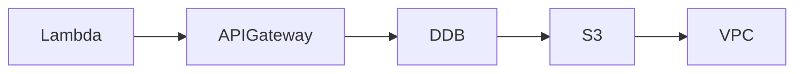

# InfraTales | AWS CDK Serverless Document Processing: VPC Endpoints, Lambda Authorizers, and DynamoDB Streams in TypeScript

**AWS CDK TYPESCRIPT reference architecture — serverless pillar | intermediate level**

> Your team needs to onboard customer documents through an API, process them automatically, and keep a full audit trail — but wiring up S3 events, Lambda authorizers, DynamoDB Streams, and VPC endpoints without creating a security or cost mess is harder than it looks. Most teams either skip the VPC entirely (and regret it at the compliance review) or throw everything in one Lambda and one IAM role with wildcard permissions. This project lays out a CDK TypeScript stack that does it right from day one: least-privilege roles per function, Gateway endpoints to avoid NAT charges, and on-demand DynamoDB so you're not paying for idle capacity.

[](LICENSE)
[](CONTRIBUTING.md)
[](https://aws.amazon.com/)
[](https://aws.amazon.com/cdk/)
[](https://infratales.com/p/82095801-0c53-433b-a55d-7e84618622e2/)
[](https://infratales.com)


## 📋 Table of Contents

- [Overview](#-overview)
- [Architecture](#-architecture)
- [Key Design Decisions](#-key-design-decisions)
- [Getting Started](#-getting-started)
- [Deployment](#-deployment)
- [Docs](#-docs)
- [Full Guide](#-full-guide-on-infratales)
- [License](#-license)

---

## 🎯 Overview

The stack is split into four CDK nested stacks — NetworkingStack, StorageStack, ComputeStack, and ApiStack — each owning a clear layer of the system [from-code]. S3 (AES-256 encrypted) holds raw documents; an S3 event triggers the DocumentProcessor Lambda inside a private VPC subnet, which writes extracted metadata to DynamoDB with Streams enabled and on-demand billing [from-code]. A separate ApiHandler Lambda sits behind API Gateway with a custom Lambda Authorizer validating API keys before any request touches storage [from-code]. The non-obvious design choice is using Gateway-type VPC endpoints for both S3 and DynamoDB — no Interface endpoint hourly charges, no NAT Gateway traffic costs — while an Interface endpoint covers API Gateway for internal consumers [inferred]. Splitting concerns across four stacks means cross-stack references are wired via CDK Outputs, which forces a specific deployment order and makes stack teardown non-trivial if you ever need to remove just one layer [editorial].

**Pillar:** SERVERLESS — part of the [InfraTales AWS Reference Architecture series](https://infratales.com).
**Target audience:** intermediate cloud and DevOps engineers building production AWS infrastructure.

---

## 🏗️ Architecture



> 📐 See [`diagrams/`](diagrams/) for full architecture, sequence, and data flow diagrams.

> Architecture diagrams in [`diagrams/`](diagrams/) show the full service topology (architecture, sequence, and data flow).
> The [`docs/architecture.md`](docs/architecture.md) file covers component responsibilities and data flow.

---

## 🔑 Key Design Decisions

- Gateway VPC endpoints for S3 and DynamoDB cost nothing per hour but only work within the same region; any cross-region call falls outside the endpoint and either fails or routes over the public internet, which will bite you if you ever add a DR region [from-code]
- On-demand DynamoDB billing is correct for unpredictable document volumes but becomes 6-7x more expensive than provisioned capacity once throughput stabilises above ~200 WCU sustained — you'll want to revisit this at scale [editorial]
- Separate IAM execution roles per Lambda (DocumentProcessor vs ApiHandler) means clean blast-radius isolation, but it also means two separate role ARNs to track in audit reports and two sets of permission drift to watch in IAM Access Analyzer [from-code]
- Custom Lambda Authorizer for API key validation adds a cold-start latency hit on the first request in a burst; without authorizer result caching tuned correctly, every cold invocation pays the full authorizer execution time before the actual handler runs [inferred]
- DynamoDB Streams feeding a Notification Lambda adds at-least-once delivery semantics — without idempotency logic in that Lambda, a stream shard retry after a partial batch failure will re-process records and potentially double-send status notifications [inferred]

> For the full reasoning behind each decision — cost models, alternatives considered, and what breaks at scale — see the **[Full Guide on InfraTales](https://infratales.com/p/82095801-0c53-433b-a55d-7e84618622e2/)**.

---

## 🚀 Getting Started

### Prerequisites

```bash
node >= 18
npm >= 9
aws-cdk >= 2.x
AWS CLI configured with appropriate permissions
```

### Install

```bash
git clone https://github.com/InfraTales/<repo-name>.git
cd <repo-name>
npm install
```

### Bootstrap (first time per account/region)

```bash
cdk bootstrap aws://YOUR_ACCOUNT_ID/YOUR_REGION
```

---

## 📦 Deployment

```bash
# Review what will be created
cdk diff --context env=dev

# Deploy to dev
cdk deploy --context env=dev

# Deploy to production (requires broadening approval)
cdk deploy --context env=prod --require-approval broadening
```

> ⚠️ Always run `cdk diff` before deploying to production. Review all IAM and security group changes.

---

## 📂 Docs

| Document | Description |
|---|---|
| [Architecture](docs/architecture.md) | System design, component responsibilities, data flow |
| [Runbook](docs/runbook.md) | Operational runbook for on-call engineers |
| [Cost Model](docs/cost.md) | Cost breakdown by component and environment (₹) |
| [Security](docs/security.md) | Security controls, IAM boundaries, compliance notes |
| [Troubleshooting](docs/troubleshooting.md) | Common issues and fixes |

---

## 📖 Full Guide on InfraTales

This repo contains **sanitized reference code**. The full production guide covers:

- Complete AWS CDK TYPESCRIPT stack walkthrough with annotated code
- Step-by-step deployment sequence with validation checkpoints
- Edge cases and failure modes — what breaks in production and why
- Cost breakdown by component and environment
- Alternatives considered and the exact reasons they were ruled out
- Post-deploy validation checklist

**→ [Read the Full Production Guide on InfraTales](https://infratales.com/p/82095801-0c53-433b-a55d-7e84618622e2/)**

---

## 🤝 Contributing

See [CONTRIBUTING.md](CONTRIBUTING.md) for guidelines. Issues and PRs welcome.

## 🔒 Security

See [SECURITY.md](SECURITY.md) for our security policy and how to report vulnerabilities responsibly.

## 📄 License

See [LICENSE](LICENSE) for terms. Source code is provided for reference and learning.

---

<p align="center">
  Built by <a href="https://infratales.com">InfraTales</a> — Production AWS Architecture for Engineers Who Build Real Systems
</p>
